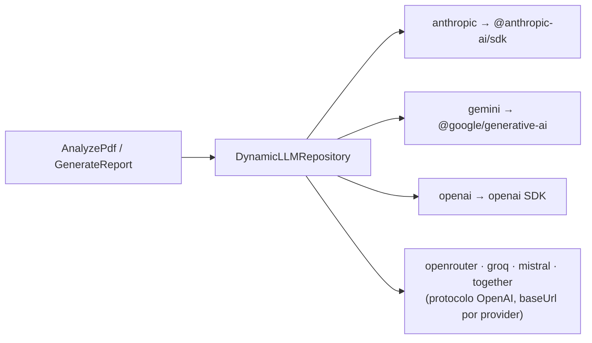

# ARQUITETURA.md — planejAÍ

> Arquitetura **real** do app em uso. Este documento descreve o que existe no código,
> não um plano. Ao mudar estrutura, rota ou contrato, atualize aqui no mesmo commit.
>
> Estado: v2 (TypeScript) implementada, empacotada como app Electron para Windows.
> A v1 Streamlit/Python saiu do versionamento (commit `87106a5`) — os arquivos
> (`app.py`, `src/`, `prompts/`, `tests/`) ainda existem em disco, ignorados pelo Git.

---

## §1. Estrutura do repositório

```
planejAÍ/
├── ARQUITETURA.md        ← este arquivo
├── CLAUDE.md             ← regras para agentes de desenvolvimento
├── dev.bat               ← sobe API + Web e abre o browser (dois terminais)
├── docs/
│   ├── adr/              ← ADRs numerados e imutáveis (0001–0015 + investimentos)
│   ├── api-contracts/    ← contratos de endpoint
│   ├── erd.md / erd.mmd  ← ERD (co-commit com schema.prisma)
│   ├── user-stories/     ← US-01 a US-10
│   ├── qa/ release/ design/
│   └── feature-forma-pagamento/
├── apps/
│   ├── api/              ← Fastify 5 + DDD manual (:3001)
│   └── web/              ← Next.js 16 App Router (:3000)
├── installer/            ← shell Electron + electron-builder (NSIS/MSI)
└── data/                 ← DB local em dev (fora do Git)
```

**Monorepo sem workspaces** — cada `apps/*` é projeto npm independente.
`cd apps/api && npm install && npm run dev`. Sem turborepo, sem hoisting mágico.

---

## §2. Backend (`apps/api/`)

### §2.1 Estrutura de pastas

```
apps/api/
├── prisma/
│   ├── schema.prisma
│   ├── migrations/       ← 11 migrations aplicadas
│   ├── template.db       ← DB semente copiado no primeiro boot
│   └── seed.ts
├── scripts/
│   ├── migrate-safe.ts   ← backup antes de migrar
│   └── backup-only.ts
└── src/
    ├── server.ts         # entrypoint: ensureDatabase → migrate → listen
    ├── app.ts            # buildApp(): Fastify + CORS + errorHandler + módulos
    ├── shared/
    │   ├── prisma.ts     # singleton PrismaClient
    │   ├── errors.ts     # HttpError
    │   ├── paths.ts      # getDataDir/getDatabaseFile/getSecretFile
    │   ├── migrate.ts    # hasPendingMigrations / runMigrations
    │   ├── backup.ts     # cópia do .db antes de migrar
    │   ├── crypto.ts     # cifra da chave de IA em repouso
    │   └── types.ts
    └── modules/
        ├── finances/     # bounded context principal
        │   ├── domain/entities/        (18 entidades)
        │   ├── domain/repositories/    (17 interfaces + IUnitOfWork)
        │   ├── domain/services/        ← escopo-despesas.ts (+ .test.ts)
        │   ├── application/use-cases/  (~70 arquivos, 1 use case cada)
        │   ├── infra/prisma-*.repository.ts  (toDomain() inline)
        │   ├── http/*.routes.ts        (17 plugins Fastify)
        │   └── finances.module.ts      # buildFinancesModule(app, prisma)
        └── intelligence/ # bounded context IA
            ├── domain/prompts/         # analyze-fatura.md, generate-report.md, index.ts
            ├── domain/repositories/    # IAnthropicRepository, IFxRateRepository
            ├── domain/use-cases/       # AnalyzePdfUseCase, GenerateReportUseCase
            ├── infra/                  # dynamic-llm, anthropic/, prisma-aiconfig, awesome-fx-rate
            ├── http/routes/            # intelligence.routes.ts, aiconfig.routes.ts
            └── intelligence.module.ts
```

### §2.2 Quatro camadas

| Camada | Regra |
|--------|-------|
| `domain` | zero imports de Fastify ou Prisma. Entidades + interfaces + serviços puros. |
| `application` | use cases recebem deps via construtor; lançam `HttpError` diretamente |
| `infra` | repos Prisma com `toDomain()` inline no mesmo arquivo; **sem classe Mapper separada** |
| `http` | plugin Fastify com validação Zod + `fastify-type-provider-zod` |

**Dívida conhecida:** os use cases de `intelligence` moram em `domain/use-cases/`
(deveriam estar em `application/`) e `intelligence.module.ts` importa 9 repositórios
Prisma de `finances` + o `PrismaUnitOfWork`. É a fronteira mais frouxa do sistema.

### §2.3 Injeção de dependência manual

```typescript
// finances.module.ts
export async function buildFinancesModule(app: FastifyInstance, prisma: PrismaClient) {
  const despesaRepo = new PrismaDespesaRepository(prisma)
  const listDespesas = new ListDespesasUseCase(despesaRepo, abaRepo)
  // ...
  await app.register(async (api) => {
    await api.register(despesasRoutes, { listDespesas, /* ... */ })
    // ...
  }, { prefix: '/api' })
}
```

**Sem decorators, sem container DI.** O prefixo `/api` é aplicado dentro do módulo.

### §2.4 Regra central: "despesa real"

`finances/domain/services/escopo-despesas.ts` é a **única** definição de quanto
se gastou num mês. Dashboard, relatório IA, export CSV e listagem passam por aqui.

| Função | Uso |
|---|---|
| `semSinteticas` | listagem CRUD — mostra cada linha real (inclusive ciclos redundantes) |
| `despesasReais` | tira `split_auto` **+** deduplica `cartao_ciclo` por (cartão, mês), mantendo a de maior valor |
| `valorEfetivo` | aplica o ratio do split da pessoa do escopo |
| `filtrarDespesasPorEscopo` / `filtrarPorPessoaId` | `pessoa` \| `familiar` \| `global` |
| `agregarMes` | mês inteiro no escopo (despesas + rendimentos + saldo) |

Escopo é representado por `EscopoPessoa = number | null | undefined`:
`number` = pessoa, `null` = familiar (só o rateado), `undefined` = global.

Coberto por `escopo-despesas.test.ts` (38 casos, `npm test` em `apps/api`).

### §2.5 Endpoints REST (todos sob `/api/`, exceto `/health`)

**Lançamentos**
| Método | Path |
|---|---|
| `GET POST` | `/api/despesas` · `PUT DELETE /api/despesas/:id` |
| `GET` | `/api/despesas/:id/splits` |
| `GET POST` | `/api/rendimentos` · `PUT DELETE /api/rendimentos/:id` |
| `GET POST` | `/api/regras-fixas` · `PUT DELETE /api/regras-fixas/:id` |

**Investimentos** (posições + movimentações, não mais snapshot único)
| Método | Path |
|---|---|
| `GET POST` | `/api/investimentos/posicoes` · `PUT DELETE /api/investimentos/posicoes/:id` |
| `GET POST` | `/api/investimentos/movimentacoes` · `PUT DELETE /api/investimentos/movimentacoes/:id` |
| `GET` | `/api/investimentos/evolucao` |

**Cartão e fatura**
| Método | Path |
|---|---|
| `GET POST` | `/api/cartoes` · `PUT DELETE /api/cartoes/:id` |
| `GET` | `/api/faturas` · `/api/faturas/:id` · `DELETE /api/faturas/:id` |
| `GET` | `/api/faturas/:id/transacoes` |
| `PUT DELETE` | `/api/faturas/:id/transacoes/:transacaoId` |
| `GET POST` | `/api/snapshots` · `DELETE /api/snapshots/:id` |
| `GET POST` | `/api/category-rules` · `PUT DELETE /api/category-rules/:id` |

**acertAÍ — divisão de gastos**
| Método | Path |
|---|---|
| `GET` | `/api/acerto?mesRef=&incluirAnteriores=&membros=` → saldo por pessoa |
| `GET` | `/api/acerto/historico` |
| `POST` | `/api/acerto` — registra pagamento, abate splits (FIFO) |
| `DELETE` | `/api/acerto/:id` |
| `GET POST` | `/api/divisao` · `PUT /api/divisao/:id` (legado de quem-deve-a-quem) |

**Cadastros**
| Método | Path |
|---|---|
| `GET POST` | `/api/pessoas` · `PUT DELETE /api/pessoas/:id` |
| `GET POST` | `/api/abas` · `PUT DELETE /api/abas/:id` |
| `GET POST` | `/api/categorias` · `PUT DELETE /api/categorias/:id` |
| `GET POST` | `/api/formas-pagamento?pessoaId=` (upsert por nome) |
| `GET PUT` | `/api/orcamentos` · `DELETE /api/orcamentos/:id` |

**Agregação e export**
| Método | Path |
|---|---|
| `GET` | `/api/dashboard` — ver §2.6 |
| `GET` | `/api/export/csv` · `/api/export/faturas/csv` |
| `GET` | `/health` |

**Intelligence**
| Método | Path |
|---|---|
| `POST` | `/api/intelligence/analyze-pdf` — extrai fatura e persiste em transação |
| `POST` | `/api/intelligence/report` — relatório executivo Markdown |
| `GET PUT` | `/api/config/ia` — provider/modelo/baseUrl (chave cifrada em repouso) |
| `POST` | `/api/config/ia/test` — testa credencial sem salvar |

### §2.6 Contrato do `/api/dashboard`

```
GET /api/dashboard?mesRef=YYYY-MM&escopo=global|familiar|pessoa&pessoaId=&meses=12
```

`escopo=pessoa` exige `pessoaId` (400 sem ele). `meses` entre 1 e 60, default 12.
Query string não carrega `null` de forma confiável — daí o enum explícito em vez de
`pessoaId` nullable.

Resposta, em **uma** chamada (sem N+1, sem reagregação no cliente):

```
totalDespesas · totalRendimentos · totalInvestido · saldo · qtdRendimentos
despesasPorAba[]          { abaId, abaNome, abaCor, total }
despesasPorCategoria[]    { categoria, total, percentual }
despesasPorFormaPagamento[] { formaPagamentoId, nome, total }
orcamentos[]              { abaId, categoria, valorMeta, gasto }
divisoesPendentes[]       { id, pessoaId, pessoaNome, valorTotal, direcao, descricao }
saldoAcertoPendente
serie[]                   { mesRef, despesas, rendimentos, saldo }   ← janela de `meses`
patrimonio                { valor, classes, serie[] { mesRef, saldo } }
```

**Ressalva conhecida:** `patrimonio.serie` vem de `getEvolucao`, ancorado em *hoje*
e não no `mesRef` pedido — navegar para um mês passado ainda mostra a série até hoje.

---

## §3. Frontend (`apps/web/`)

Next.js **16** App Router, React 18, sem Tailwind, sem ESLint. CSS em `styles/`.

```
apps/web/src/
├── app/
│   ├── layout.tsx · providers · page.tsx (redirect → /dashboard)
│   ├── dashboard/   (page.tsx, DashboardPersonaKpis.tsx, DashboardCharts, types.ts)
│   ├── despesas/ rendimentos/ investimentos/ cartao/ relatorio/ gestao/
│   └── acertai/     ← divisão de gastos entre pessoas
├── components/
│   ├── layout/      Sidebar · PageHeader · WelcomeModal
│   └── ui/          Button · Card · DataTable · EmptyState · FormField
│                    KpiCard · MiniMesSelector · Modal · MoneyValue
├── shared/
│   ├── constants/financas.ts
│   ├── context/     MesRefContext · PersonaContext   ← mês e escopo globais
│   ├── hooks/useCategorias.ts
│   ├── lib/         api.ts (NEXT_PUBLIC_API_BASE_URL) · format.ts
│   └── providers/
├── types/           despesas · rendimentos · investimentos · cartoes
└── styles/          tokens.css · app.css
```

### §3.1 Rotas

| Rota | Página |
|------|--------|
| `/dashboard` | KPIs, série de 12 meses, patrimônio, gastos por forma de pagamento |
| `/despesas` | CRUD por mês/aba, splits, parcelamento, recorrência |
| `/rendimentos` | CRUD de receitas |
| `/investimentos` | posições + movimentações + evolução |
| `/cartao` | upload de fatura (IA), transações, ciclo |
| `/acertai` | quem deve a quem, registro de acertos, histórico |
| `/relatorio` | relatório executivo gerado por IA |
| `/gestao` | cartões, pessoas, abas, categorias, formas de pagamento, metas |

### §3.2 Regras de componentes

- Server Components por padrão; `'use client'` em formulários, modais, gráficos
- TanStack Query para mutations e leituras client-side
- **Sem Zustand/Redux** — `useState`/`useReducer` + dois contexts (`MesRef`, `Persona`)
- PDF no cliente com `pdfjs-dist` + `pdf-lib` (render/split antes de mandar pra IA)
- Ícones: `lucide-react`. Gráficos: `recharts`.

### §3.3 Dívidas de UI conhecidas

- ~780 `style={{}}` inline contra ~250 `className` — media queries não alcançam
- `alert()`/`confirm()` nativos em vários pontos, apesar de `Modal.tsx` existir
- Acessibilidade rasa: poucos `aria`/`role`, Modal sem focus trap
- Fontes divergem do ADR-0005 — ver §5

---

## §4. Banco de dados

Prisma 6 + SQLite. Um único `schema.prisma` unificando os três bancos do legado.

**22 models:** `Pessoa` `AbaDespesa` `AbaPessoa` `Categoria` `RegraFixa` `CategoryRule`
`Despesa` `DespesaSplit` `DivisaoEntry` `AcertoEntry` `AcertoDespesaSplit` `Orcamento`
`Rendimento` `Investimento` `MovimentacaoInvestimento` `Cartao` `CartaoSplit` `Fatura`
`Transacao` `SnapshotCiclo` `AIConfig` `FormaPagamento`.

### §4.1 Localização do arquivo

`shared/paths.ts` resolve o diretório de dados nesta ordem:

1. `PLANEJAI_DATA_DIR` (o Electron passa `app.getPath('userData')`)
2. fallback `<repo>/data/`

O DB fica em `<dataDir>/planejAI.db` e o segredo de cifra em `<dataDir>/.secret`.

> **Dev e app instalado compartilham o mesmo arquivo** (`%APPDATA%\planejAI\planejAI.db`)
> quando `PLANEJAI_DATA_DIR` aponta pra lá. Rodar migration em dev mexe no banco real.
> Faça backup (`npm run db:backup`) antes.

### §4.2 Boot e migrations

`server.ts` → `ensureDatabase()` copia `prisma/template.db` se não existir DB →
`migrateDatabase()` faz backup (salvo `SKIP_BACKUP=true`) e aplica migrations pendentes.
Falha de migration **não** derruba o app: loga e segue (drift vira 500 visível).

`npm run db:migrate` usa `scripts/migrate-safe.ts`, que faz backup antes.

> Migration de *table-rebuild* em `Despesa` já causou perda em cascata de `DespesaSplit`
> (quebrou o acertAÍ). Trate qualquer migration que recrie tabela como destrutiva.

### §4.3 Convenções

- `mesRef` sempre `YYYY-MM` (string)
- Valores monetários em `Float` (reais) — nunca centavos
- `toDomain()` inline no repo Prisma
- Soft-delete via `ativo`/`ativa`

---

## §5. Design system

Tokens em `apps/web/src/styles/tokens.css` — nomes canônicos + aliases `--app-*`.

Cores: `--verde #10F5A3` (primária) · `--roxo #B07AFF` (pessoas/splits) ·
`--azul #6FA9D6` (informacional) · `--vermelho #F23A0A` (alerta) · escala `--cinza-*`.
Há ainda uma paleta `--bank-*` para identidade de banco nas faturas.

**Divergência aberta com o ADR-0005:** o ADR fixa Bricolage Grotesque (display) +
Plus Jakarta Sans (body). O código carrega **Inter** (`next/font/google`) para display
e body, e JetBrains Mono para valores. Uma das duas fontes de verdade precisa ceder —
hoje o código é que vale.

---

## §6. IA (`modules/intelligence/`)

### §6.1 Multi-provider

Não é mais só Anthropic. `DynamicLLMRepository` implementa `IAnthropicRepository` e
roteia por provider configurado em runtime (persistido no model `AIConfig`, chave
cifrada em disco via `shared/crypto.ts` + `.secret`).



`AIProvider = anthropic | openai | gemini | openrouter | groq | mistral | together`.
`OPENAI_COMPATIBLE_BASE_URLS` traz a baseUrl default de cada compatível; o usuário
pode sobrescrever em `/gestao`.

**Prompt caching** (`cache_control: { type: 'ephemeral' }`) existe **apenas** no caminho
Anthropic — é recurso do SDK deles. Modelo default do caminho Anthropic:
`claude-sonnet-4-6`. `max_tokens: 8192`.

### §6.2 Use cases

| Use case | Entrada | Saída |
|---|---|---|
| `AnalyzePdfUseCase` | PDF/imagem base64 + `cartaoId` | fatura + transações + despesa de ciclo + splits, tudo persistido |
| `GenerateReportUseCase` | mês + escopo | Markdown executivo |

`AnalyzePdfUseCase` grava **dentro de `IUnitOfWork.run()`** (`PrismaUnitOfWork`,
timeout 30s). A chamada de IA fica fora da transação. O guard de `fileHash` é
checado duas vezes: fora (não gastar chamada de IA) e dentro (fechar corrida de
uploads simultâneos).

`AwesomeFxRateRepository` busca câmbio para converter transações em moeda estrangeira.

### §6.3 System prompts

`domain/prompts/analyze-fatura.md` e `generate-report.md`, carregados por `index.ts`
com `readFileSync`. Placeholders injetados em runtime: `{{CATEGORIAS}}` (do banco),
regras de categorização, tipo de arquivo e cotações de câmbio.

---

## §7. Execução

### §7.1 Dev

```bash
dev.bat            # sobe API e Web em terminais separados e abre o browser

# ou manualmente:
cd apps/api && npm install && npm run dev   # Fastify :3001
cd apps/web && npm install && npm run dev   # Next :3000
cd apps/api && npm test                     # testes puros do domínio
```

A API escuta em `127.0.0.1` por padrão. Sem autenticação (ADR-0004), o socket
**precisa** ficar no loopback — só saia dele com `HOST` explícito e motivo.

### §7.2 Distribuição desktop — Electron, não Tauri

`installer/` é um shell Electron (`main.js`) que sobe API (:3001) e Web (:3000) como
processos filhos, passando `PLANEJAI_DATA_DIR = app.getPath('userData')`.
Empacotamento com `electron-builder`:

```bash
cd installer && npm run dist       # NSIS (.exe)
cd installer && npm run dist:msi   # MSI
```

`scripts/build-all.mjs` roda no `prebuild`. **Sem Vercel. Sem cloud. Sem servidor remoto.**

> ADR-0014 e o texto antigo falavam em Tauri. A implementação foi Electron.

---

## §8. Variáveis de ambiente

```env
# apps/api
PORT=3001                    # default 3001
HOST=127.0.0.1               # default loopback — mudar só com motivo
PLANEJAI_DATA_DIR=...        # onde vive planejAI.db e .secret
PLANEJAI_DB_TEMPLATE=...     # override do template.db
CORS_ORIGIN=http://localhost:3000
SKIP_BACKUP=true             # pula backup automático antes de migrar
DATABASE_URL="file:..."      # usado pelo Prisma CLI

# apps/web
NEXT_PUBLIC_API_BASE_URL="http://localhost:3001"
```

A chave de IA **não** vem de env: é gravada cifrada no banco via `/api/config/ia`.

---

## §9. Regras de desenvolvimento (enforcement para agentes)

1. `domain/` nunca importa Fastify, Prisma ou SDK de IA
2. Sem classe Mapper — `toDomain()` inline no repo
3. `HttpError` direto nos use cases — sem Result/Either
4. Server Components primeiro; `'use client'` só com interatividade real
5. Sem Zustand/Redux
6. `cache_control` em toda chamada Anthropic
7. `mesRef` sempre `YYYY-MM` string
8. Valores em Float (reais)
9. **Qualquer soma de despesa passa por `escopo-despesas.ts`** — não reimplemente a regra
10. Escrita multi-tabela em fluxo de fatura passa por `IUnitOfWork`

---

## §10. Fora do escopo

Autenticação/login · deploy cloud · multi-tenancy · i18n · notificações push.

## §11. Dívidas e extensões

- Fronteira `intelligence → finances` (9 repos importados) e use cases em `domain/`
- Cobertura de teste só nas funções puras de `escopo-despesas`
- `patrimonio.serie` ancorada em hoje, não no `mesRef` (§2.6)
- Fontes divergindo do ADR-0005 (§5)
- Acessibilidade e estilos inline no frontend (§3.3)
- `docs/status.md`, ADRs e `docs/erd.md` merecem passada de sincronia
- Importação OFX · OCR multi-página · metas com progresso mensal
