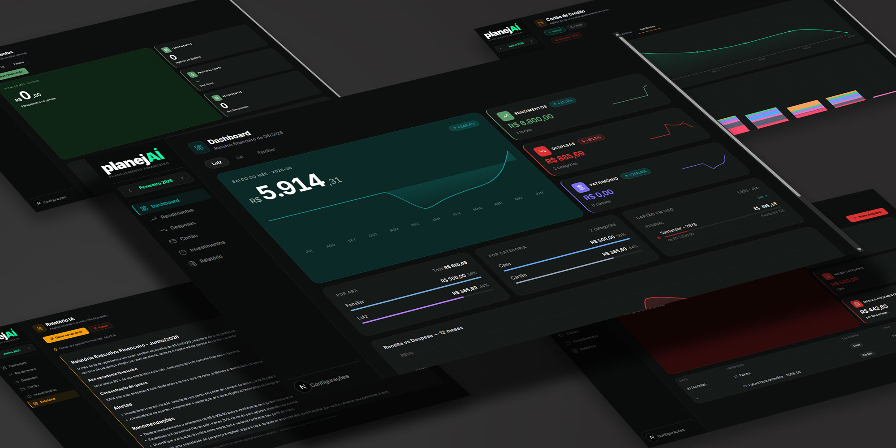

# planejAÍ

App de planejamento financeiro pessoal **local-first**. Sem cloud, sem assinatura, sem anúncios — dados ficam 100% na sua máquina.



---

## Funcionalidades

### Dashboard
- KPIs do mês: rendimentos, despesas, saldo, patrimônio investido
- Gráfico de despesas por categoria (donut)
- Evolução mensal 12 meses — Receita vs. Despesa
- Widget do ciclo de cartão em aberto com meta e dias restantes
- Breakdown por aba e por categoria
- Seletor de mês de referência

### Despesas
- Tipos: `única`, `recorrente`, `parcelada`
- Parcelamento distribui em N meses automaticamente
- Recorrência propaga para meses futuros
- **Split familiar**: divide o valor entre membros, cria entradas por pessoa
- Orçamentos por categoria com indicador de progresso
- Edição e exclusão inline (instância ou série completa)

### Rendimentos
- Categorias: Salário, Freelas, Dividendos, Aluguel, Outros
- Recorrência automática
- Gráfico de histórico e donut por categoria

### Cartão de Crédito
- **Análise de faturas por IA**: upload PDF/imagem → IA extrai e categoriza automaticamente
- Compatível com Claude, GPT, Gemini e OpenRouter
- Suporte a PDFs com senha
- Propagação de categoria entre faturas com regra persistente
- Acompanhamento do ciclo: ritmo diário, projeção, dias restantes
- Histórico completo com comparativo mensal
- Alertas de parcelamentos

### Investimentos
- Snapshot mensal por classe (Renda Fixa, Ações, FIIs, Cripto, etc.)
- Histórico de evolução patrimonial

### Relatório IA
- Resumo executivo do mês gerado por IA
- Análise de padrões de gasto, variações e recomendações
- Privacidade: apenas agregações por categoria são enviadas à IA

### Gestão
- Cadastro de cartões (banco, limite, cor, dia de fechamento)
- Pessoas e abas de despesa
- Categorias personalizadas
- Orçamentos mensais
- Regras de categorização automática
- Configuração da chave da API (Anthropic / OpenRouter)

---

## Stack

| Camada | Tecnologia |
|---|---|
| Frontend | Next.js 15 App Router + TypeScript |
| Backend | Fastify 5 + `fastify-type-provider-zod` |
| ORM | Prisma 6 + SQLite |
| IA | Anthropic SDK (`claude-sonnet-4-6`) |
| Gráficos | Recharts |
| Ícones | Lucide React |

---

## Setup

**Pré-requisitos:** Node.js 20+, npm

### API

```bash
cd apps/api
npm install
npm run db:migrate   # backup automático + prisma migrate dev
npm run dev          # :3001
```

### Web

```bash
cd apps/web
npm install
npm run dev          # :3000
```

### Variáveis de ambiente

Crie `apps/api/.env`:

```env
DATABASE_URL="file:../../data/planejAI.db"
ANTHROPIC_API_KEY="sk-ant-..."   # opcional — configure também em Gestão → IA
```

> **Dica Windows**: use `dev.bat` na raiz para abrir os dois terminais de uma vez.

---

## Estrutura

```
planejai/
├── apps/
│   ├── api/                    # Fastify 5
│   │   ├── prisma/schema.prisma
│   │   └── src/modules/
│   │       ├── finances/       # despesas, rendimentos, cartões, investimentos
│   │       └── intelligence/   # análise de faturas por IA
│   └── web/                    # Next.js 15
│       └── src/app/
│           ├── dashboard/
│           ├── despesas/
│           ├── rendimentos/
│           ├── cartao/
│           ├── investimentos/
│           ├── relatorio/
│           └── gestao/
└── dev.bat                     # abre api + web em dois terminais
```

---

## Privacidade

Todos os dados ficam em `data/planejAI.db` — SQLite local (caminho configurável via `PLANEJAI_DATA_DIR`). Backups automáticos `data/planejAI.db.bak-{timestamp}` são gerados antes de cada migration. Nenhum dado enviado a servidores externos, exceto agregações de categorias enviadas à API de IA para análise (opcional, sob sua própria chave).

---

## Versão

**v1.0** — Windows · Electron desktop em breve
