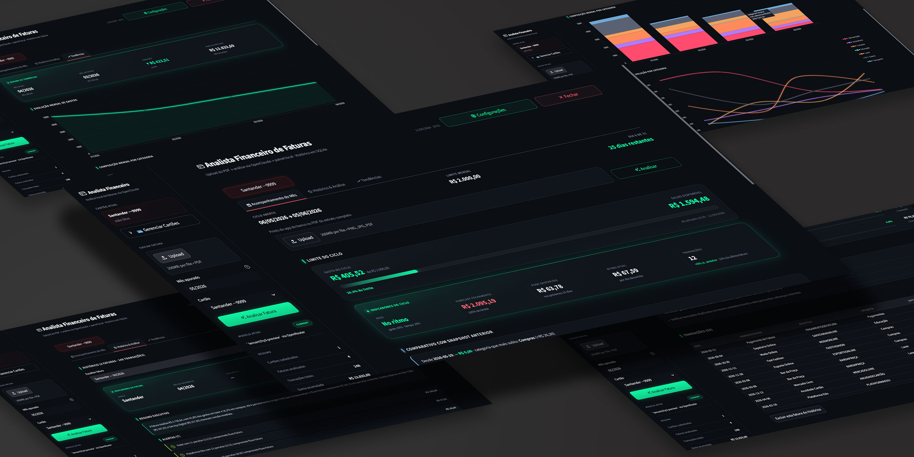

# Analista Financeiro de Faturas

Um painel local para análise de faturas de cartão de crédito, implementado com **Streamlit** e **OpenClaude CLI**, que:

- Extrai texto de PDFs de faturas via `pdfplumber` e envia para análise por IA.
- Categoriza automaticamente todas as transações em 7 categorias padronizadas.
- Detecta alertas de variação: gastos atípicos, duplicidades, recorrências novas e parcelamentos longos.
- Armazena histórico completo em **SQLite local** — nenhum dado sai da sua máquina.
- Gera gráficos de tendência mensal e composição por categoria via Plotly.
- Suporta múltiplos cartões com chips de seleção, limites individuais e cores por banco.
- Permite acompanhar o **mês em aberto** via OCR de prints do app do banco, com forecast de fechamento e pace diário.

---

## 📁 Estrutura do projeto

```
analista_faturas_sts/
├── app.py                         # app Streamlit principal
├── requirements.txt               # dependências Python
├── .mcp_empty.json                # config vazia de MCP (exigida pelo CLI)
├── Analista de Faturas STS.vbs    # launcher Windows (abre o app no browser)
├── prompts/
│   └── system_prompt.md           # prompt de sistema do agente de análise
├── src/
│   ├── agent.py                   # integração com OpenClaude CLI (subprocess)
│   ├── charts.py                  # gráficos Plotly (linha, barra empilhada)
│   ├── database.py                # SQLite: cartões, faturas, transações, regras
│   ├── database_acompanhamento.py # SQLite separado para snapshots do mês corrente
│   ├── image_extractor.py         # OCR de prints via pytesseract
│   ├── metrics_acompanhamento.py  # pace, forecast, allowance diário
│   ├── pdf_extractor.py           # extração de texto de PDF via pdfplumber
│   └── ui.py                      # componentes visuais reutilizáveis + CSS
└── data/                          # criado automaticamente; ignorado pelo git
    ├── faturas.db
    ├── acompanhamento.db
    ├── agent.log
    └── pdfs/
```

---

## 🔧 Instalação

**Pré-requisitos:** Python 3.10+, Node.js 18+, Git

1. Clone este repositório:

   ```bash
   git clone https://github.com/soutes/analista_faturas_sts.git
   cd analista_faturas_sts
   ```

2. Crie e ative o ambiente virtual:

   ```bash
   python -m venv .venv
   .venv\Scripts\activate      # Windows
   # source .venv/bin/activate  # Linux/Mac
   ```

3. Instale as dependências:

   ```bash
   pip install -r requirements.txt
   ```

4. Instale o **OpenClaude CLI** (necessário para o agente de análise):

   ```bash
   npm install -g openclaude
   ```

   > Faça login com `openclaude login` e garanta que o modelo desejado está configurado.

5. Para OCR de prints (aba Acompanhamento), instale o **Tesseract**:

   - Windows: baixe o installer em [UB Mannheim](https://github.com/UB-Mannheim/tesseract/wiki) e adicione ao PATH.
   - Linux: `sudo apt install tesseract-ocr tesseract-ocr-por`

---

## 🚀 Uso

### Iniciar o app

```bash
streamlit run app.py
```

Ou use o launcher Windows:

```
Analista de Faturas STS.vbs   ← duplo clique
```

---

### Fluxo principal: análise de fatura PDF

1. Cadastre seu cartão em **Gerenciar Cartões** (barra lateral)
2. Faça upload do PDF da fatura e selecione o cartão correspondente
3. Clique em **Analisar Fatura** — o agente processa e retorna JSON estruturado
4. Navegue pelas abas:

| Aba | O que mostra |
|-----|--------------|
| **Acompanhamento do Mês** | Gastos do ciclo aberto, pace vs. limite, forecast de fechamento |
| **Histórico & Análise** | Fatura completa: KPIs, alertas, categorias, top estabelecimentos |
| **Tendências** | Evolução mensal, composição por categoria, comparativo entre meses |

---

### Acompanhamento do mês em aberto

Na aba **Acompanhamento do Mês**, faça upload de prints do app do banco (PNG/JPG) ou de um PDF de extrato parcial. O app usa OCR + IA para extrair as transações e calcular:

- Pace atual vs. limite (no ritmo / atenção / estourando)
- Forecast de fechamento do ciclo
- Quanto pode gastar por dia nos dias restantes
- Comparativo com o snapshot anterior

---

## ⚙️ Configurações

Acesse o botão **Configurações** no topo do app para:

- **Aba Ciclo**: ajustar limite mensal global e dia de fechamento da fatura
- **Aba Cartões**: editar nome, final, limite e cor de cada cartão; remover cartões com confirmação

---

## 🗂️ Múltiplos cartões

O app suporta N cartões simultaneamente. Use os chips no topo da tela para alternar entre cartões ou visualizar todos consolidados. Cada cartão mantém:

- Cor automática por banco (Santander → vermelho, Nubank → roxo, C6 → dourado, etc.)
- Limite individual (usado no pace e forecast)
- Histórico de faturas independente
- Snapshots de acompanhamento separados

---

## 📂 Dados e privacidade

Todos os dados ficam em `data/` na sua máquina — nunca são enviados para servidores externos. O único tráfego externo é a chamada ao **OpenClaude CLI**, que usa a API configurada localmente (ex.: OpenRouter, Anthropic direto).

O arquivo `data/` está no `.gitignore` — PDFs, bancos SQLite e logs não entram no repositório.

---

## 📚 Referências

- [Streamlit Docs](https://docs.streamlit.io)
- [pdfplumber](https://github.com/jsvine/pdfplumber)
- [Plotly Python](https://plotly.com/python/)
- [Tesseract OCR](https://github.com/tesseract-ocr/tesseract)
- [OpenClaude CLI](https://github.com/Gitlawb/openclaude)

