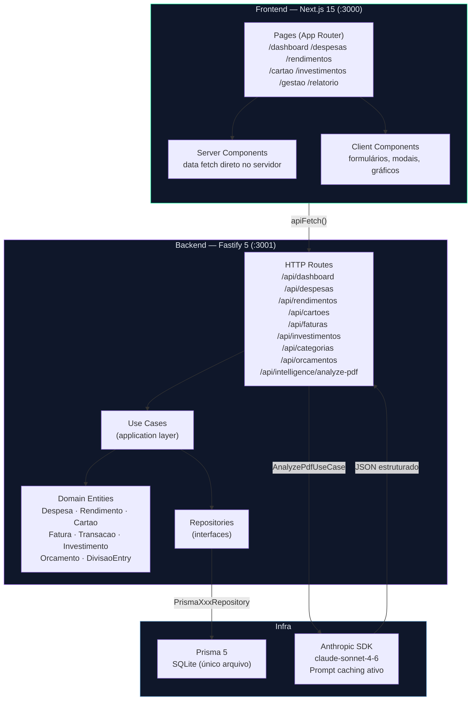

# planejAÍ v2.0

> **planej + AÍ** → "planeje aí" (coloquial BR: *planeje agora*)  
> **planej + AI** → inteligência artificial integrada para análise de faturas

App de planejamento financeiro pessoal **local-first**, reescrito do zero em TypeScript. Roda com dois terminais (`api :3001` + `web :3000`). Sem cloud, sem autenticação — dados ficam 100% na sua máquina.

---

## Funcionalidades

### Dashboard
- KPIs do mês: rendimentos, despesas, saldo, patrimônio investido
- Gráfico de despesas por categoria (donut)
- Evolução mensal 12 meses — Receita vs. Despesa (dados reais, sem mock)
- Widget do ciclo de cartão em aberto com meta e dias restantes
- Breakdown por aba e por categoria
- Seletor de mês de referência

### Despesas
- Lançamento manual por categoria, data e valor
- Tipos: `normal`, `recorrente`, `parcelado`, `split_auto`
- Parcelamento: distribui em N meses consecutivos automaticamente
- Recorrência: propaga para meses futuros
- **Split familiar**: lançar na aba Familiar divide o valor entre membros, cria entradas de divisão por pessoa e lança a cota do usuário na aba Pessoal
- Orçamentos por categoria com indicador de progresso
- Filtros por mês e por aba
- Edição e exclusão inline (instância ou série completa)

### Rendimentos
- Categorias: Salário, Freelas, Dividendos, Aluguel, Outros
- Recorrência automática por N meses
- Gráfico de histórico e donut por categoria
- KPIs: total do mês, maior fonte, variação vs. mês anterior

### Cartão de Crédito
- **Análise de faturas por IA**: upload de PDF ou imagem → Claude extrai e categoriza todas as transações automaticamente
- Suporte a PDFs com senha
- **Propagação de categoria**: alterar a categoria de um estabelecimento aplica a mudança em todas as faturas e cria regra persistente para análises futuras
- Modo de edição em lote: edite múltiplas categorias e salve em uma operação
- KPI de meta vs. gasto (orçamentos do mês ou limite do cartão como fallback)
- Projeção de gasto até o fechamento do ciclo
- Acompanhamento do ciclo em aberto: ritmo diário, projeção, dias restantes
- Histórico completo de faturas com comparativo
- Gráficos de tendência: evolução mensal, por categoria (stacked bar), por cartão
- Alertas automáticos: parcelamentos prestes a terminar, novos parcelamentos longos
- Suporte a múltiplos cartões com chips de seleção, cor e agrupamento pessoal/familiar

### Investimentos
- Snapshot mensal por categoria (Renda Fixa, Tesouro Direto, Ações, FIIs, Cripto, etc.)
- Aporte do mês e patrimônio total
- Histórico de evolução patrimonial com gráfico de área

### Relatório
- Resumo executivo do mês gerado por IA (Claude)
- Comentário sobre padrões de gasto, variações e recomendações

### Gestão
- Cadastro de cartões de crédito (nome, banco, final, limite, cor, proprietário, dia de fechamento)
- Cadastro de pessoas e abas de despesa com membros
- Categorias personalizadas (aparecem em todos os dropdowns e no prompt de análise da IA)
- Orçamentos mensais por categoria e aba
- Regras de categorização automática (padrão → categoria)
- Chave da API Anthropic

---

## Arquitetura



---

## Stack

| Camada | Tecnologia |
|---|---|
| Frontend | Next.js 15 App Router + TypeScript |
| Backend | Fastify 5 + `fastify-type-provider-zod` |
| ORM | Prisma 5 + SQLite |
| IA | Anthropic TypeScript SDK (`claude-sonnet-4-6`) |
| Gráficos | Recharts |
| Ícones | Lucide React |
| Fontes | Bricolage Grotesque · Plus Jakarta Sans · JetBrains Mono |

---

## Setup

**Pré-requisitos:** Node.js 20+, npm

### API (`apps/api`)

```bash
cd apps/api
npm install
npx prisma migrate dev
npm run dev          # :3001
```

### Web (`apps/web`)

```bash
cd apps/web
npm install
npm run dev          # :3000
```

### Variáveis de ambiente

Crie `apps/api/.env`:

```env
DATABASE_URL="file:./prisma/dev.db"
ANTHROPIC_API_KEY="sk-ant-..."   # opcional — configure também em Gestão → IA
```

> **Dica Windows**: use `dev.bat` na raiz para abrir os dois terminais de uma vez.

---

## Estrutura do monorepo

```
planejai/
├── apps/
│   ├── api/                    # Fastify 5 — backend
│   │   ├── prisma/
│   │   │   └── schema.prisma   # schema unificado (SQLite)
│   │   └── src/
│   │       └── modules/
│   │           ├── finances/   # bounded context principal
│   │           │   ├── domain/
│   │           │   ├── application/
│   │           │   ├── infra/
│   │           │   └── http/
│   │           └── intelligence/  # análise de faturas por IA
│   └── web/                    # Next.js 15 — frontend
│       └── src/app/
│           ├── dashboard/
│           ├── despesas/
│           ├── rendimentos/
│           ├── cartao/
│           ├── investimentos/
│           ├── relatorio/
│           └── gestao/
├── dev.bat                     # abre api + web em dois terminais
└── ARQUITETURA.md              # decisões de design detalhadas
```

---

## Privacidade

Todos os dados ficam em `apps/api/prisma/dev.db` — SQLite local. Nenhum dado enviado a servidores externos, exceto o conteúdo das faturas enviado à API Anthropic para análise (opcional e sob sua chave de API).
