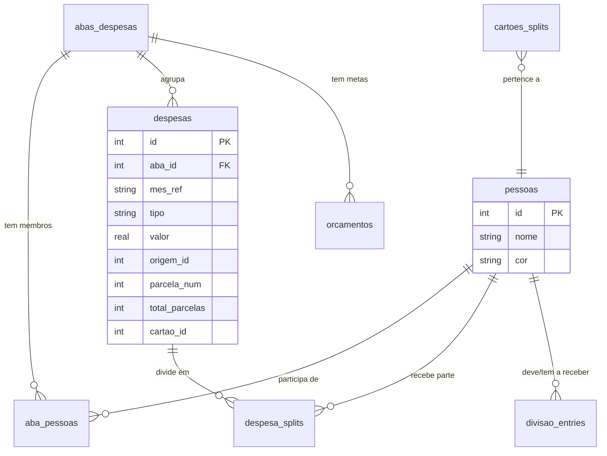

# Arquitetura — planejAÍ

## Contexto

**planejAÍ** é um app de planejamento financeiro pessoal **desktop-first** para o mercado brasileiro. O foco é clareza mensal: onde o dinheiro foi, para onde deveria ir, e o que o saldo diz sobre o mês.

O app roda **100% local** — sem servidor, sem conta, sem dados em nuvem. Toda inteligência externa (IA para análise de fatura) é opcional e acionada explicitamente pelo usuário.

**Stack atual:**
- UI: Python + Streamlit 1.32+
- Dados: SQLite 3 (3 bancos locais via `sqlite3` stdlib + pandas)
- Gráficos: Plotly 5.20+
- IA: provedor configurável (Claude API, OpenAI, Gemini) — opcional; credenciais em `gestao.db` via `src/config_ia.py`
- OCR: pytesseract + Tesseract — opcional
- PDF: pdfplumber
- Launcher: VBScript (Windows nativo, modo `--app` sem barra de URL)

**Usuário-alvo:** pessoa física usando o próprio computador; suporte opcional a uso familiar compartilhado (abas + splits).

---

## 1. Estrutura do repositório

```
Gestor_Financeiro/
├── app.py                          # Entry point: sidebar, Visão Geral, Configurações
├── planejai.vbs                    # Launcher Windows (Edge/Chrome --app mode)
├── requirements.txt
├── README.md
├── design-brief.md
│
├── prompts/
│   └── system_prompt.md            # System prompt do agente de análise de faturas
│
├── assets/
│   └── brand/                      # SVGs de produção: favicon, wordmark, app-icon, logo.css
│
├── planejA_ Design System/
│   └── design_handoff_planejai/    # Referência de design (não tocar — ver seção 6)
│
├── src/
│   ├── app.py → entry point
│   ├── page_cartao.py              # Cartão de Crédito (fatura PDF + OCR + acompanhamento)
│   ├── page_rendimentos.py         # Rendimentos (lançamento + recorrência + histórico)
│   ├── page_despesas.py            # Despesas (manual + split + parcelamento + orçamentos)
│   ├── page_investimentos.py       # Investimentos (snapshot mensal por classe de ativo)
│   ├── database_gestao.py          # gestao.db — dados principais
│   ├── database.py                 # faturas.db — cartões, faturas, transações
│   ├── database_acompanhamento.py  # acompanhamento.db — snapshots do mês em aberto
│   ├── agent.py                    # Pipeline IA: Analista → QA → Relator
│   ├── config_ia.py                # Persistência criptografada de credenciais de IA
│   ├── charts.py                   # Gráficos Plotly (dark theme + categoria colors)
│   ├── image_extractor.py          # OCR de prints via pytesseract
│   ├── metrics_acompanhamento.py   # Pace, forecast, allowance diário
│   ├── pdf_extractor.py            # Extração de texto de PDF via pdfplumber
│   └── ui.py                       # CSS injection + helpers visuais + page_icon()
│
├── docs/
│   ├── ARQUITETURA.md              # ← você está aqui
│   ├── user-stories/               # US-XX-<slug>.md (geradas pelo agente product-owner)
│   └── adr/                        # Architecture Decision Records (ver seção 8)
│
└── data/                           # Criado automaticamente — ignorado pelo git
    ├── gestao.db
    ├── faturas.db
    ├── acompanhamento.db
    ├── agent.log
    └── pdfs/
```

---

## 2. Bancos de dados

Três arquivos SQLite independentes, cada um com responsabilidade separada. **Sem FK entre arquivos** — referências cruzadas são mantidas por código.

| Banco | Arquivo | Responsabilidade |
|---|---|---|
| **gestao.db** | `src/database_gestao.py` | Dados principais: pessoas, abas, despesas, splits, rendimentos, investimentos, orçamentos, cartoes_splits |
| **faturas.db** | `src/database.py` | Cartões de crédito, faturas analisadas por IA, transações categorizadas, regras de categorização |
| **acompanhamento.db** | `src/database_acompanhamento.py` | Snapshots do mês em aberto (OCR + manual), configuração de ciclo |

### 2.1 gestao.db — schema simplificado

```
pessoas                 → membros da casa/família
abas_despesas           → agrupamentos de despesa (ex.: Pessoal, Familiar)
aba_pessoas             → N:N abas ↔ pessoas com ratio_default de split
categorias_despesa      → categorias configuráveis por usuário
regras_fixas            → despesas fixas recorrentes por aba
despesas                → lançamentos mensais (manual, parcelado, recorrente, cartao_ciclo, split_auto)
despesa_splits          → divisão por pessoa de uma despesa
divisao_entries         → visão individual do split (quem deve quanto a quem)
orcamentos              → meta de gasto por categoria/aba/mês
rendimentos             → entradas do mês (salário, freelas, dividendos etc.)
investimentos_snapshots → patrimônio por categoria/instituição/mês
cartoes_splits          → proporção de divisão de um cartão entre pessoas
```

**Tipos de despesa (`tipo`):**

| Valor | Origem |
|---|---|
| `manual` | Lançamento direto pelo usuário |
| `parcelado` | Parcela de compra dividida em N meses |
| `recorrente` | Despesa propagada automaticamente para meses futuros |
| `cartao_ciclo` | Total do cartão materializado automaticamente ao fechar o ciclo |
| `split_auto` | Espelho criado na aba Pessoal quando há split familiar |

### 2.2 faturas.db — schema simplificado

```
cartoes       → cartões cadastrados (nome, cor, limite, final, proprietário, aba_id)
faturas       → faturas analisadas (PDF hash, banco, mês, total, analise_json)
transacoes    → itens da fatura com categoria editável
category_rules → regras automáticas de categorização por padrão de texto
```

### 2.3 acompanhamento.db — schema simplificado

```
config    → limite_mensal, dia_fechamento
snapshots → total + qtd_transações por cartão/ciclo (JSON completo das transações)
```

### 2.4 ERD — relações principais (gestao.db)



---

## 3. Módulos e páginas

### 3.1 `app.py` — Entry point

- Sidebar fixa (220 px): wordmark Inter ExtraBold, navegação com ícones SVG inline, stepper de mês
- Visão Geral: KPIs do mês (saldo, rendimentos, despesas, patrimônio), próximos vencimentos, gráfico de despesas por categoria, resumo de divisão familiar
- Configurações: Pessoas, Abas, Categorias, Cartões (com aba + split config), Ciclo
- Session state: `mes_atual`, `aba_selecionada`, `_cartao_synced`
- Lazy sync ao iniciar: `db_g.sync_all_cartoes()` — materializa faturas fechadas como despesas

### 3.2 `src/page_despesas.py`

- Abas de despesa configuráveis (tabs dinâmicas)
- **Lançamento manual:** formulário com data, descrição, categoria, valor, notas, parcelamento, recorrência
- **Split automático:** ao lançar em aba Familiar → divide entre membros → cria `despesa_splits` + `divisao_entries` + espelho `split_auto` em Pessoal
- Visualização: tabela com badges de tipo (`parcelado`, `recorrente`, `split_auto`, `💳 FATURA`)
- Despesas `cartao_ciclo` são read-only (🔒)
- Orçamentos por categoria: barras de progresso com glow de alerta ao ultrapassar
- Visão anual: tabela e gráfico empilhado 12 meses × categorias

### 3.3 `src/page_cartao.py`

- **Upload de fatura PDF:** pdfplumber extrai texto → Agente Analista (provedor configurado) analisa → salva em `faturas.db` → `sync_cartao_ciclo()` materializa como despesa
- **Upload de print (OCR):** pytesseract → snapshot parcial em `acompanhamento.db`
- Acompanhamento do mês em aberto: pace, forecast, allowance diário (via `metrics_acompanhamento.py`)
- Múltiplos cartões: chips de seleção, cor por banco, limite individual
- Histórico de faturas: comparativo entre meses, edição de categorias inline
- Gráficos: evolução mensal, composição por categoria, stacked bar por transação

### 3.4 `src/page_rendimentos.py`

- Lançamento de receitas por categoria (Salário, Aluguel, Freelas, Dividendos, Outros)
- Recorrência: propaga para N meses futuros
- Gráficos: donut por categoria + histórico mensal 12 meses
- KPIs: total do mês, maior fonte, variação vs. mês anterior

### 3.5 `src/page_investimentos.py`

- Snapshot mensal de patrimônio por categoria (Renda Fixa, Tesouro, Ações, BDR/ETF, FIIs, Crypto, Previdência, CDB/LCI/LCA, Outros)
- Aporte do mês por categoria
- Histórico imutável: edição liberada apenas para o mês atual
- KPIs: total, variação, maior posição
- Gráficos: donut de distribuição + linha/barra de evolução

---

## 4. Fluxo de entrada de dados

O app suporta três formas de registrar gastos — todas convergem para a mesma tabela `despesas`:

```
┌─────────────────────────────────────────────────────┐
│               ENTRADA DE DESPESAS                   │
├─────────────────┬───────────────────┬───────────────┤
│  Manual         │  Upload PDF       │  Upload Imagem│
│  (formulário)   │  (fatura cartão)  │  (print OCR)  │
├─────────────────┼───────────────────┼───────────────┤
│ page_despesas   │ page_cartao       │ page_cartao   │
│ ↓               │ ↓                 │ ↓             │
│ db_g.despesas   │ pdfplumber        │ pytesseract   │
│ (tipo=manual)   │ → Agente IA       │ → snapshot    │
│                 │ → faturas.db      │   (acomp.db)  │
│                 │ → sync_cartao_ciclo               │
│                 │   → db_g.despesas │               │
│                 │     (tipo=        │               │
│                 │      cartao_ciclo)│               │
└─────────────────┴───────────────────┴───────────────┘
```

**Regra:** `cartao_ciclo` é gerado automaticamente ao fechar o ciclo do cartão. Não pode ser editado manualmente — apenas o cartão/fatura pode alterá-lo.

---

## 5. Pipeline de IA (Agentes)

O planejAÍ usa agentes sequenciais para análise de fatura. A cadeia completa é:

```
PDF / Texto extraído
        │
        ▼
┌───────────────────┐
│  Agente Extrator  │  pdfplumber → texto bruto
│  (pdf_extractor)  │  pytesseract → texto de imagem
└─────────┬─────────┘
          │
          ▼
┌───────────────────┐
│  Agente Analista  │  Claude CLI com system_prompt.md
│  (agent.py)       │  → JSON estruturado (fatura + transações
│                   │    + resumo + alertas + recomendações)
└─────────┬─────────┘
          │
          ▼
┌───────────────────┐
│  Agente QA        │  Valida o JSON retornado:
│  (a implementar)  │  • schema completo (campos obrigatórios)
│                   │  • totais batem (soma transações ≈ total)
│                   │  • categorias válidas (whitelist)
│                   │  • datas no formato correto
│                   │  → aprova ou rejeita com motivo
└─────────┬─────────┘
          │ aprovado
          ▼
┌───────────────────┐
│  Agente Relator   │  Gera comentário executivo final
│  (a implementar)  │  com base no JSON validado +
│                   │  histórico de meses anteriores
│                   │  → string em PT-BR, 2–4 frases
└─────────┬─────────┘
          │
          ▼
     faturas.db → despesas (tipo=cartao_ciclo)
```

### 5.1 Agente Analista (`agent.py` + `config_ia.py`)

- Chama o provedor configurado (Claude API, OpenAI ou Gemini) com `prompts/system_prompt.md`
- Input: texto da fatura
- Output: JSON com schema `fatura / transacoes / resumo_categorias / alertas / recomendacoes / comentario_executivo`
- Timeout: 120 s
- Log em `data/agent.log`

### 5.2 Agente QA (a implementar)

Validações mínimas antes de aceitar o JSON:

| Verificação | Critério |
|---|---|
| Schema | Campos `fatura`, `transacoes`, `resumo_categorias` presentes |
| Totais | `sum(transacoes[*].valor)` dentro de ±2% do `fatura.total` |
| Categorias | Cada `categoria` ∈ whitelist de 7 categorias |
| Datas | `data` em formato `YYYY-MM-DD` ou `null` |
| Valores | Nenhum `valor` negativo em transações comuns (crédito aceito) |
| Duplicidades | Alerta se mesmo estabelecimento + valor + data aparece 2x |

Se falhar: re-envia ao Analista com o erro específico (máx. 2 retries antes de rejeitar).

### 5.3 Agente Relator (a implementar)

- Recebe JSON validado + últimas 3 faturas do mesmo cartão
- Gera `comentario_executivo` contextualizado (variação, tendências, alertas principais)
- Output: string PT-BR, tom direto, sem disclaimers

---

## 6. Design System

Toda implementação visual segue o `planejAÍ Design System` em:
```
planejA_ Design System/design_handoff_planejai/
```

### Regras de uso

**Nunca altere** os arquivos em `design_handoff_planejai/` — são referência imutável.

| Arquivo de referência | O que faz | Como usar |
|---|---|---|
| `colors_and_type.css` | Tokens: cores, tipografia, espaçamento, radii, glows | Copiar tokens para o bloco CSS em `src/ui.py` |
| `components.css` | Contrato visual dos componentes | Espelhar em `src/ui.py` ao adicionar novos componentes |
| `ui_kits/app/` | Protótipo React da UI | Referência visual apenas — não portar código |
| `assets/` | SVGs de produção: favicon, wordmark, mark, logo.css | Copiar para `assets/brand/` e referenciar do Python |
| `preview/*.html` | Specimens visuais de cada componente | Abrir no browser para verificar fidelidade |

### Paletas

| Contexto | Accent | Regra |
|---|---|---|
| **App (em produção)** | `#10F5A3` neon green | Toda tela que o usuário vê hoje no Streamlit |
| **Brand (marketing)** | `#2dbdb6` turquoise | README hero, slides, landing futura |

### Componentes-chave (`src/ui.py`)

- `page_icon(name, size, color)` — ícone SVG inline para cabeçalhos de página
- CSS injetado via `st.markdown(unsafe_allow_html=True)`: KPI cards, glow box, big progress bar, category rows, alerts, section heads, botões 5 variantes

---

## 7. Roadmap técnico

### Fase 1 — Atual (Streamlit local)

- App roda via `streamlit run app.py` ou `planejai.vbs`
- Credencial IA: configurada em Configurações → Agente IA; armazenada criptografada em `gestao.db`
- Configurações em `acompanhamento.db` (limite, dia de fechamento)

### Fase 2 — Melhoria de agentes

- Implementar Agente QA (validação de JSON do analista)
- Implementar Agente Relator (comentário contextualizado com histórico)
- Separar `agent.py` em módulo por responsabilidade (`agent_extractor`, `agent_analyst`, `agent_qa`, `agent_reporter`)

### Fase 3 — Installer (futuro)

**Objetivo:** distribuir como `.exe` instalável no Windows, sem Python/Node visível para o usuário.

Decisões a tomar:
- Bundler: PyInstaller (simples) ou Nuitka (mais robusto)
- Launcher: substituir VBS por atalho `.lnk` ou `.exe` nativo
- Streamlit embarcado: processo filho controlado pelo launcher
- **Tela de configuração de IA:** já implementada como aba em Configurações → Agente IA (`src/config_ia.py`); no installer, exibir na primeira execução se não houver credencial salva
- Atualização: verificar GitHub releases na inicialização (opt-in)

```
Installer → data/config.db → chave_api (criptografada)
                           → claude_cli_path
                           → preferencias_ui
```

### Fase 4 — Multi-usuário (futuro)

- Login local simples (PIN ou senha) para separar perfis no mesmo computador
- Dados por usuário em subpastas de `data/`
- Sincronização opcional via pasta compartilhada (OneDrive/Google Drive) para uso familiar

---

## 8. ADRs — Decisões de arquitetura

`docs/adr/` — cada decisão em arquivo separado numerado. Template:

```markdown
# ADR-NNNN: <título>

- **Status:** Accepted | Superseded by ADR-XXXX | Deprecated
- **Data:** YYYY-MM-DD

## Contexto
Qual problema levou a esta decisão?

## Decisão
O que foi decidido.

## Consequências
O que facilita, dificulta ou compromete a manter.

## Alternativas consideradas
Outras opções e motivo de descarte.
```

ADRs iniciais a registrar:

| Nº | Título | Resumo |
|---|---|---|
| 0001 | Streamlit como framework único | Prioridade em velocidade de entrega; tradeoff: sem SPA, sem componentes customizados complexos |
| 0002 | 3 bancos SQLite separados | Isolamento de responsabilidade; tradeoff: FKs cruzadas impossíveis, sync por código |
| 0003 | Provedor de IA configurável pelo usuário | Multi-provedor (Claude API, OpenAI, Gemini); credencial Fernet-encrypted em gestao.db |
| 0004 | Sem autenticação no MVP | App local, usuário único; auth entra apenas no installer multi-usuário |
| 0005 | Design System imutável como referência | Evita drift visual; toda mudança de UI passa pelo handoff primeiro |
| 0006 | cartao_ciclo como despesa sintética | Cartão precisa aparecer no fluxo de caixa do mês sem duplicar dados |
| 0007 | Agente QA antes do Relator | Garante JSON válido antes de consumir em relatório; evita erros silenciosos |

---

## 9. Setup local

```bash
# 1. Clone
git clone https://github.com/soutes/planejai.git
cd planejai

# 2. Ambiente virtual
python -m venv .venv
.venv\Scripts\activate

# 3. Dependências
pip install -r requirements.txt

# 4. (Opcional) IA — análise de fatura PDF
npm install -g @anthropic-ai/claude-code
claude login

# 5. (Opcional) OCR — prints do app do banco
# Windows: instalar Tesseract via https://github.com/UB-Mannheim/tesseract/wiki
# Adicionar ao PATH

# 6. Rodar
streamlit run app.py
# ou duplo clique em planejai.vbs (modo app nativo)
```

Os bancos SQLite são criados automaticamente em `data/` na primeira execução.

---

## 10. Validação end-to-end

Como confirmar que tudo funciona:

1. **Despesa manual:** Despesas → lançar R$ 50 em Alimentação → aparece na Visão Geral do mesmo mês
2. **Split familiar:** Despesas (aba Familiar) → lançar R$ 200 → verificar `despesa_splits` + espelho `split_auto` em Pessoal
3. **Fatura PDF:** Cartão → upload de PDF → IA analisa → transações listadas → total materializa como `cartao_ciclo` em Despesas
4. **OCR de print:** Cartão → upload de imagem → snapshot salvo → pace e forecast atualizados
5. **Investimentos:** Investimentos → snapshot do mês atual → donut atualizado → histórico 12 meses correto
6. **Recorrência:** Rendimentos → lançar com recorrência 3 meses → verificar entradas nos meses seguintes

---

## 11. Fora de escopo (MVP atual)

- Autenticação / login
- Sincronização em nuvem ou API externa
- App mobile / responsividade
- Metas de longo prazo (ex.: aposentadoria, reserva de emergência)
- Importação de extrato bancário (OFX/CSV)
- Notificações / alertas por push/e-mail
- Relatórios em PDF exportáveis
- i18n / suporte a moeda não-BRL
- Testes automatizados (unitários, E2E)

Cada item é candidato natural a fase futura ou extensão pós-MVP.
