# ERD — planejAÍ v2.0

> Fonte canônica do modelo de dados. Co-commit obrigatório com `schema.prisma` e `migration.sql`.
> Última atualização: 2026-05-30 — sincronizado AIConfig.updatedAt; mantidos AcertoEntry + AcertoDespesaSplit + DespesaSplit.valorQuitado (US-12/US-13)

```mermaid
erDiagram
    Pessoa {
        Int     id        PK
        String  nome
        String  cor       "default #B07AFF"
        Boolean ativo     "default true"
        Boolean familiar  "default false"
        Boolean padrao    "default false"
    }

    AbaDespesa {
        Int     id                    PK
        String  nome
        String  icon                  "default 💸"
        String  cor                   "default #10F5A3"
        Int     ordem                 "default 0"
        String  splitDestinoCategoria "nullable"
        Boolean ativo                 "default true"
        Int     pessoaId              "nullable FK"
    }

    AbaPessoa {
        Int   id           PK
        Int   abaId        FK
        Int   pessoaId     FK
        Float ratioDefault "default 0.5"
    }

    Categoria {
        Int     id         PK
        String  nome       UK
        String  icon       "default 📌"
        Boolean padrao     "default false"
        Boolean permanente "default true"
        Boolean ativa      "default true"
    }

    RegraFixa {
        Int     id            PK
        Int     abaId         FK
        String  descricao
        String  categoria
        Float   valor
        Int     diaVencimento "nullable"
        Boolean ativo         "default true"
    }

    CategoryRule {
        Int    id        PK
        String pattern   UK
        String categoria
        String createdAt
    }

    Despesa {
        Int     id              PK
        Int     abaId           FK
        String  mesRef          "YYYY-MM"
        String  data            "nullable YYYY-MM-DD"
        String  descricao
        String  categoria
        Float   valor
        String  notas           "nullable"
        String  tipo            "default manual"
        Boolean recorrente      "default false"
        Int     totalRepeticoes "nullable"
        Int     origemId        "nullable — plain col, sem FK"
        Int     parcelaNum      "nullable"
        Int     totalParcelas   "nullable"
        Boolean emFaturaCartao  "default false"
        Int     cartaoId        "nullable FK SET NULL"
        Boolean somenteMeu      "default false"
    }

    DespesaSplit {
        Int   id             PK
        Int   despesaId      FK
        Int   pessoaId       FK
        Float ratio
        Float valorCalculado
        Float valorQuitado   "default 0 — controle de acerto parcial (US-13)"
    }

    DivisaoEntry {
        Int     id              PK
        Int     pessoaId        FK
        String  mesRef
        String  descricao
        Float   valorTotal
        String  direcao         "default a_receber"
        Boolean parcelado       "default false"
        Int     totalParcelas   "nullable"
        Int     parcelaAtual    "nullable default 1"
        String  dataInicio      "nullable"
        Int     origemDespesaId "nullable FK SET NULL"
        Boolean quitado         "default false"
        String  notas           "nullable"
    }

    AcertoEntry {
        Int      id             PK
        Int      pessoaId       FK
        String   mesRef         "YYYY-MM — mês sendo acertado"
        Float    valor
        String   data           "YYYY-MM-DD"
        String   formaPagamento "'pix'|'ted'|'dinheiro'|'outro'"
        String   observacao     "nullable"
        DateTime criadoEm       "default now()"
    }

    AcertoDespesaSplit {
        Int   id           PK
        Int   acertoId     FK
        Int   splitId      FK
        Float valorCoberto
    }

    Orcamento {
        Int    id        PK
        Int    abaId     FK
        String mesRef    "nullable — null = meta padrão"
        String categoria
        Float  valorMeta
    }

    Rendimento {
        Int     id              PK
        Int     pessoaId        "nullable FK"
        String  mesRef          "YYYY-MM"
        String  descricao
        String  categoria       "default Salário"
        Float   valor
        Boolean recorrente      "default false"
        Int     totalRepeticoes "nullable"
        Int     origemId        "nullable — plain col, sem FK"
    }

    Investimento {
        Int     id          PK
        Int     pessoaId    "nullable FK"
        String  categoria
        String  instituicao "default vazio"
        Boolean ativo       "default true"
        String  notas       "nullable"
    }

    MovimentacaoInvestimento {
        Int    id             PK
        Int    investimentoId FK
        String mesRef         "YYYY-MM"
        String tipo           "APORTE|RENDIMENTO|RESGATE"
        Float  valor          "sempre positivo"
        String notas          "nullable"
    }

    Cartao {
        Int     id            PK
        String  nome
        String  proprietario  "nullable"
        String  finalDigitos  "nullable"
        String  cor           "default #10F5A3"
        Float   limite        "nullable"
        Int     diaFechamento "default 5"
        Boolean ativo         "default true"
        Int     abaId         "nullable FK SET NULL"
    }

    CartaoSplit {
        Int   id       PK
        Int   cartaoId FK
        Int   pessoaId FK
        Float ratio
    }

    Fatura {
        Int    id                  PK
        String fileHash            UK
        String arquivoOriginal
        String banco               "nullable"
        String mesReferencia       "nullable YYYY-MM"
        String vencimento          "nullable YYYY-MM-DD"
        Float  total               "nullable"
        Float  limite              "nullable"
        String comentarioExecutivo "nullable Markdown"
        String analiseJson         "JSON snapshot — fonte de verdade"
        String criadoEm            "ISO 8601"
        Int    cartaoId            FK
    }

    Transacao {
        Int    id              PK
        Int    faturaId        FK
        String data            "nullable YYYY-MM-DD"
        String descricao       "nullable"
        String estabelecimento "nullable"
        Float  valor           "nullable positivo=débito"
        String categoria       "nullable"
        String parcela         "nullable ex: 1/3"
    }

    SnapshotCiclo {
        Int    id            PK
        Int    cartaoId      FK
        String cicloInicio   "YYYY-MM-DD"
        String cicloFim      "YYYY-MM-DD"
        String dataUpload    "ISO 8601"
        Float  total
        Int    qtdTransacoes "default 0"
        String jsonDados     "JSON análise completa"
    }

    AIConfig {
        Int      id        PK "singleton id=1"
        String   provider  "default anthropic"
        String   apiKey    "AES-256-GCM encrypted"
        String   model     "default claude-sonnet-4-6"
        String   baseUrl   "custom base URL"
        DateTime updatedAt  "@updatedAt"
    }

    %% Relações existentes
    AbaDespesa  ||--o{ AbaPessoa              : "CASCADE"
    Pessoa      ||--o{ AbaPessoa              : "CASCADE"
    AbaDespesa  ||--o{ Despesa                : "CASCADE"
    AbaDespesa  ||--o{ RegraFixa              : "CASCADE"
    AbaDespesa  ||--o{ Orcamento              : "CASCADE"
    AbaDespesa  }o--o| Cartao                 : "SET NULL"
    Despesa     ||--o{ DespesaSplit           : "CASCADE"
    Pessoa      ||--o{ DespesaSplit           : "CASCADE"
    Pessoa      ||--o{ DivisaoEntry           : "CASCADE"
    Despesa     }o--o| DivisaoEntry           : "SET NULL"
    Pessoa      ||--o{ Investimento           : "SET NULL"
    Investimento ||--o{ MovimentacaoInvestimento : "CASCADE"
    Cartao      ||--o{ Fatura                 : "RESTRICT"
    Cartao      ||--o{ SnapshotCiclo          : "CASCADE"
    Cartao      ||--o{ CartaoSplit            : "CASCADE"
    Pessoa      ||--o{ CartaoSplit            : "CASCADE"
    Fatura      ||--o{ Transacao              : "CASCADE"
    Cartao      }o--o| Despesa                : "SET NULL"
    AbaDespesa  }o--o| Pessoa                 : "CASCADE (abaPropria)"

    %% Novas relações — Acerto de Contas (US-12/US-13)
    Pessoa      ||--o{ AcertoEntry            : "CASCADE"
    AcertoEntry ||--o{ AcertoDespesaSplit     : "CASCADE"
    DespesaSplit ||--o{ AcertoDespesaSplit    : "RESTRICT"
```

---

## Índices

| Tabela | Índice | Tipo |
|--------|--------|------|
| `AbaPessoa` | `(abaId, pessoaId)` | UNIQUE |
| `Categoria` | `nome` | UNIQUE |
| `CategoryRule` | `pattern` | UNIQUE |
| `Despesa` | `(abaId, mesRef)` | INDEX |
| `Despesa` | `(cartaoId, mesRef)` | INDEX |
| `Despesa` | `origemId` | INDEX |
| `DivisaoEntry` | `(pessoaId, quitado)` | INDEX |
| `DivisaoEntry` | `mesRef` | INDEX |
| `Orcamento` | `(abaId, mesRef, categoria)` | UNIQUE |
| `Rendimento` | `mesRef` | INDEX |
| `Rendimento` | `(pessoaId, mesRef)` | INDEX |
| `Investimento` | `(pessoaId, categoria, instituicao)` | UNIQUE |
| `MovimentacaoInvestimento` | `(investimentoId, mesRef)` | INDEX |
| `MovimentacaoInvestimento` | `mesRef` | INDEX |
| `CartaoSplit` | `cartaoId` | INDEX |
| `CartaoSplit` | `(cartaoId, pessoaId)` | UNIQUE |
| `Fatura` | `fileHash` | UNIQUE |
| `Fatura` | `cartaoId` | INDEX |
| `Fatura` | `mesReferencia` | INDEX |
| `Transacao` | `faturaId` | INDEX |
| `Transacao` | `categoria` | INDEX |
| `Transacao` | `data` | INDEX |
| `SnapshotCiclo` | `cartaoId` | INDEX |
| `SnapshotCiclo` | `(cicloInicio, cicloFim)` | INDEX |
| `AcertoEntry` | `(pessoaId, mesRef)` | INDEX |
| `AcertoDespesaSplit` | `acertoId` | INDEX |
| `AcertoDespesaSplit` | `splitId` | INDEX |

---

## Notas de modelagem

### `mesRef`
Sempre `YYYY-MM` (string). Nunca objeto `Date` para referência de mês.

### `Despesa.tipo`
| valor | origem |
|-------|--------|
| `manual` | entrada manual pelo usuário |
| `fixa` | gerada a partir de `RegraFixa` |
| `parcela` | parcelamento de compra |
| `cartao` | vínculo com transação de fatura |
| `cartao_ciclo` | total sintético do ciclo do cartão |
| `split_auto` | cópia automática para aba de split |

### `DespesaSplit.valorQuitado`
Campo novo (US-13). Armazena quanto do `valorCalculado` já foi coberto por acertos.
`saldo_pendente = valorCalculado - valorQuitado`.
`0` = nenhum acerto ainda. `valorCalculado` = totalmente quitado.

### `AcertoDespesaSplit.splitId` — RESTRICT
Não é possível deletar um `DespesaSplit` já coberto por acerto.
Para desfazer: excluir o `AcertoEntry` primeiro (reverte `valorQuitado`).

### `origemId` (Despesa e Rendimento)
Plain column — sem FK definida no Prisma (self-reference gerenciada pela aplicação).
Aponta para o `id` do primeiro registro da série recorrente/parcelada.

### `Fatura` vs `SnapshotCiclo`
- `Fatura`: fatura histórica fechada, salva permanentemente
- `SnapshotCiclo`: ciclo em aberto, máximo 2 por cartão (atual + anterior para delta)

### `Fatura.cartaoId` — RESTRICT
Não é possível deletar um `Cartao` que tenha `Fatura`s associadas.
Desativar cartão (`ativo=false`) não deleta as faturas históricas.

### `Orcamento` com `mesRef` nullable
`mesRef=null` = meta padrão (fallback quando não há meta específica do mês).
SQLite permite múltiplos `NULL` no unique index — convenção da app garante um único padrão por `(abaId, categoria)`.

### `Cartao` sentinela `id=1`
Reservado para `nome='Sem cartão'`, `ativo=false`.
Cobre faturas importadas sem cartão atribuído. Nunca deletar.

### `AIConfig` singleton
`id=1` fixo. Upsert sempre com `where: { id: 1 }, create: { id: 1, ... }`.
